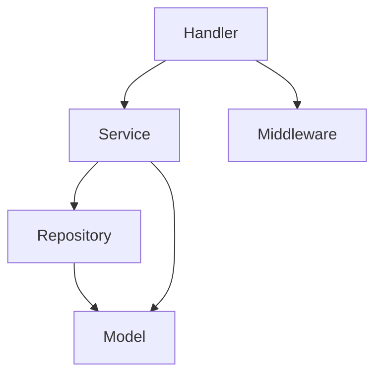

# Codebase Document

## Metadata

- **Last Updated**: [YYYY-MM-DD]

---

## Tech Stack

- **Language**: [e.g., Go 1.22, TypeScript 5.x]
- **Framework**: [e.g., Gin, Express, Next.js]
- **Database**: [e.g., PostgreSQL 16, Redis 7]
- **Libraries**: [Key libraries with purpose]
- **Infrastructure**: [e.g., Docker, Kubernetes, AWS Lambda]
- **Build Tools**: [e.g., Make, Turbopack, esbuild]

---

## Project Structure

```
.
├── cmd/
│   └── server/
│       └── main.go              # Application entry point
├── internal/
│   ├── handler/
│   │   ├── user_handler.go      # User API handlers
│   │   └── order_handler.go     # Order API handlers
│   ├── service/
│   │   ├── user_service.go      # User business logic
│   │   └── order_service.go     # Order business logic
│   ├── repository/
│   │   ├── user_repo.go         # User data access
│   │   └── order_repo.go        # Order data access
│   └── model/
│       ├── user.go              # User domain model
│       └── order.go             # Order domain model
├── pkg/
│   └── middleware/
│       ├── auth.go              # Authentication middleware
│       └── logging.go           # Request logging middleware
├── config/
│   └── config.go                # Configuration loading
├── migrations/
│   └── 001_init.sql             # Database migrations
├── go.mod
├── go.sum
├── Makefile
└── README.md
```

> Replace the example above with the actual project structure. List every file with a brief description of its purpose.

---

## Key Abstractions

[Interfaces, base classes, or shared utilities that new code should follow]

- **[Abstraction Name]**: [Purpose, location, and usage]

---

## Conventions

- **Naming**: [e.g., snake_case for files, PascalCase for types]
- **Error Handling**: [e.g., custom error types, error wrapping strategy]
- **Configuration**: [e.g., env vars with Viper, .env files]
- **Logging**: [e.g., structured logging with slog, log levels]
- **Testing**: [e.g., table-driven tests, testify, test file naming]

---

## Module Dependencies

[Describe which modules depend on each other and the dependency direction]



> Dependency flows top-down. Lower layers should not import upper layers.
