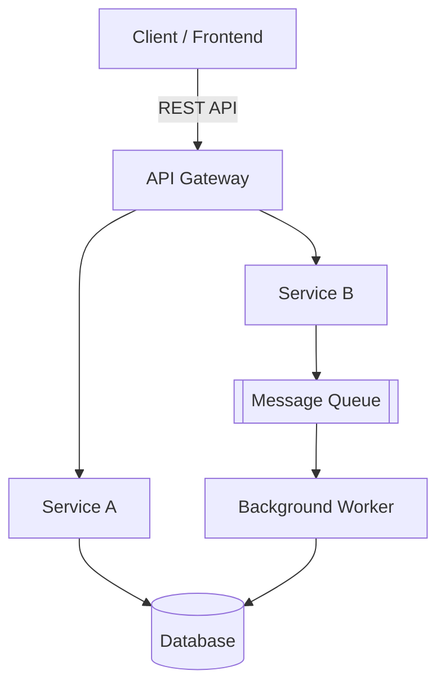
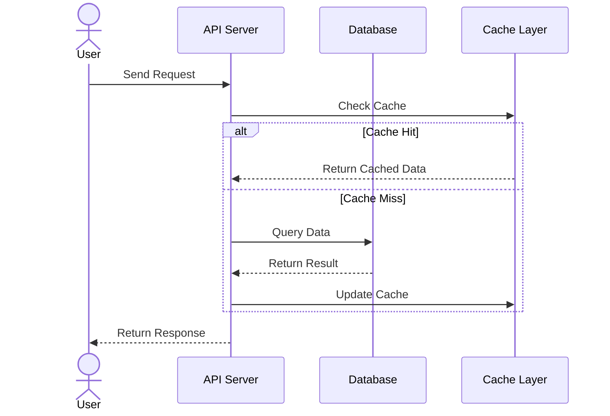
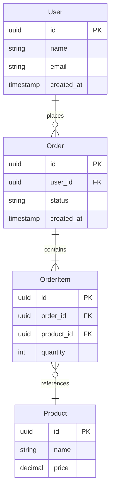

# [Feature/Project Name]

## Metadata

- **Created**: [YYYY-MM-DD]
- **Last Updated**: [YYYY-MM-DD]

## Summary

[2-3 sentences describing what this EDD covers and what problem it solves]

---

## Proposed Solution

### High-Level Architecture

[Provide a system diagram showing major components and data flow]



**Key Components**:
- **Component A**: [Brief description]
- **Component B**: [Brief description]

**Data Flow**:



### API Design

[Choose REST, GraphQL, or gRPC based on your needs]

**For REST APIs**: Use [OpenAPI 3.x](https://spec.openapis.org/oas/latest.html) specification. Define the API contract in a separate file (e.g., `openapi.yaml`).

**For GraphQL**:
```graphql
type Resource {
  id: ID!
  name: String!
  # Key fields only
}

type Query {
  resource(id: ID!): Resource
}

type Mutation {
  createResource(input: CreateResourceInput!): Resource!
}
```

**For gRPC**:
```protobuf
service ResourceService {
  rpc GetResource(GetResourceRequest) returns (Resource) {}
  rpc CreateResource(CreateResourceRequest) returns (Resource) {}
}
```

### Data Model

**Database Schema**:
```sql
-- Main table(s) with key columns, indexes, and constraints
CREATE TABLE resources (
  id UUID PRIMARY KEY,
  name VARCHAR(255) NOT NULL,
  created_at TIMESTAMP DEFAULT NOW()
);

CREATE INDEX idx_resources_name ON resources(name);
```

**Entity Relationships**:



### Security & Authentication

- **Authentication**: [JWT / OAuth / API Keys]
- **Authorization**: [RBAC / Permissions model]
- **Data Encryption**: [At rest / In transit]
- **Input Validation**: [Key validation rules]
- **Rate Limiting**: [Limits per user/IP]

### Performance Considerations

- **Expected Load**: [RPS, concurrent users, data volume]
- **Caching Strategy**: [Redis/CDN/Application cache with TTLs]
- **Database Optimization**: [Indexes, connection pooling, read replicas]
- **Async Processing**: [Background jobs, queues]
- **Scalability**: [Horizontal/vertical scaling approach]

---


## Testing Strategy

### Unit Tests
- Coverage goal: [e.g., 80% for business logic]
- Focus: Model validation, business logic, utilities

### Integration Tests
- Coverage: All API endpoints
- Scenarios: Happy path, error cases, edge cases

### Performance Tests
- Load testing: [Target load]
- Stress testing: [Find breaking point]
- Tools: [JMeter, k6, Locust]

### Security Tests
- Penetration testing
- Dependency vulnerability scanning

---

## Alternatives Considered

### Alternative 1: [Name]
**Pros**:
- [Pro 1]
- [Pro 2]

**Cons**:
- [Con 1]
- [Con 2]

**Decision**: [Why was this not chosen?]

---

## Open Questions

- [ ] **Q1**: [Question that needs discussion]
- [ ] **Q2**: [Another unresolved issue]

---

## References

- [Related PRD: Link]
- [External documentation: Link]
- [Research or blog post: Link]
- ...

---

